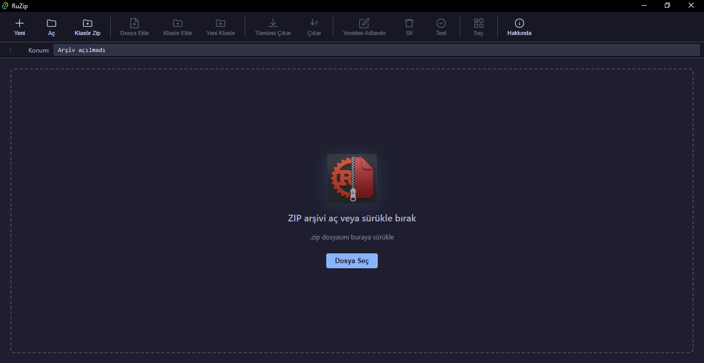
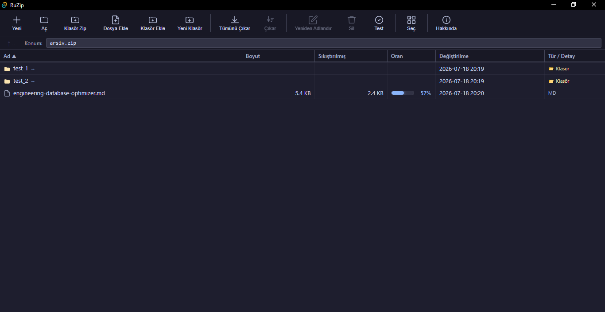
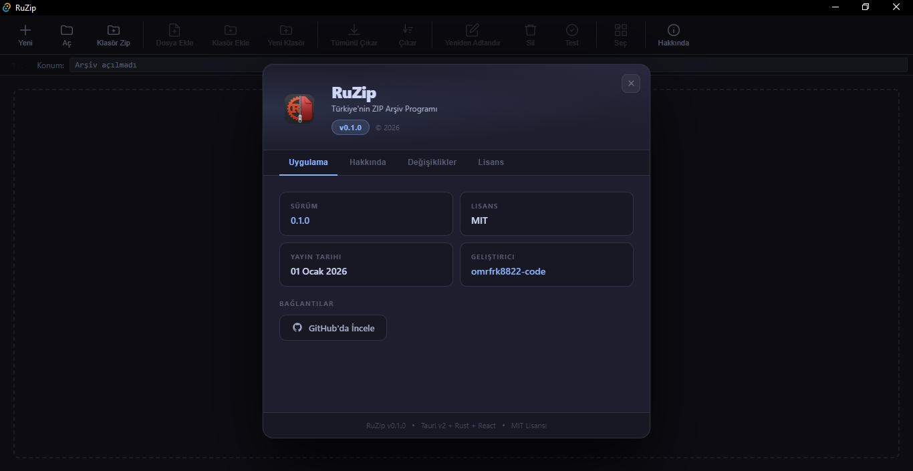

<div align="center">
  

  # RuZip — Türkiye'nin ZIP Arşiv Programı

  Tauri v2 + React + TypeScript + Rust ile geliştirilmiş, yerli ve açık kaynaklı masaüstü ZIP arşivleyici.  
  Catppuccin Mocha dark tema, Türkçe arayüz.

  **Sürüm:** `0.1.0` — © 2026

  [](LICENSE)
  [](https://tauri.app)
  [](https://www.rust-lang.org)
</div>

---

## 📥 İndir

Son sürüm: **v0.1.1**

### 🪟 Windows

| Tip | Açıklama | İndir |
|-----|----------|-------|
| 🏠 Inno Setup | Önerilen. Sağ tık menüsü + dosya ilişkilendirme dahil | [RuZip_Setup_0.1.1.exe](https://github.com/omrfrk8822-code/Ruzip/releases/download/v0.1.1/RuZip_Setup_0.1.1.exe) |
| 📦 MSI | Wix MSI kurulum | [RuZip_0.1.1_x64_tr-TR.msi](https://github.com/omrfrk8822-code/Ruzip/releases/download/v0.1.1/RuZip_0.1.1_x64_tr-TR.msi) |
| 🧳 Portable | Taşınabilir, kurulum gerekmez | [RuZip.exe](https://github.com/omrfrk8822-code/Ruzip/releases/download/v0.1.1/RuZip.exe) |

> ⚠️ **Windows Güvenlik Uyarısı:** İmzasız bir uygulama olduğu için Windows "Windows cihazını korudu" uyarısı gösterebilir. **"Yine de çalıştır"** butonuna tıklayarak güvenle kullanabilirsiniz.

### 🐧 Linux

| Tip | Dağıtım | İndir |
|-----|---------|-------|
| 📦 AppImage | Tüm dağıtımlar (Ubuntu, Fedora, Arch, vb.) | [RuZip_0.1.1_amd64.AppImage](https://github.com/omrfrk8822-code/Ruzip/releases/download/v0.1.1/RuZip_0.1.1_amd64.AppImage) |
| 📦 deb | Ubuntu, Debian, Mint, Pop!_OS | [RuZip_0.1.1_amd64.deb](https://github.com/omrfrk8822-code/Ruzip/releases/download/v0.1.1/RuZip_0.1.1_amd64.deb) |

### 🍎 macOS

| Tip | İşlemci | İndir |
|-----|---------|-------|
| 📦 DMG | Apple Silicon (M1, M2, M3, M4) | [RuZip_0.1.1_aarch64.dmg](https://github.com/omrfrk8822-code/Ruzip/releases/download/v0.1.1/RuZip_0.1.1_aarch64.dmg) |
| 📦 DMG | Intel (x86_64) | CI'da üretilecek — şimdilik kaynak koddan derleyin |

> 💡 Tüm sürümler ve geçmiş dosyalar için: [Releases sayfası](https://github.com/omrfrk8822-code/Ruzip/releases)

---

## Ekran Görüntüleri

> Uygulama açıldığında karşılama ekranı (dropzone):



> Arşiv içeriği görünümü:



> Hakkında penceresi:



---

## Proje Yapısı

```
ruzip/
├── src/                          # React/TypeScript frontend
│   ├── App.tsx                   # Ana uygulama — tüm state ve handler'lar
│   ├── components/
│   │   ├── FileList.tsx          # Dosya listesi tablosu (sıralama, checkbox, drag-drop)
│   │   ├── Toolbar.tsx           # Üst toolbar butonları
│   │   ├── Dialog.tsx            # Custom modal dialog bileşeni
│   │   ├── AboutModal.tsx        # Hakkında penceresi (sekmeli)
│   │   └── StatusBar.tsx         # Alt durum çubuğu
│   └── styles/
│       └── global.css            # Catppuccin tema, tüm CSS
├── src-tauri/
│   ├── src/
│   │   ├── lib.rs                # Tauri builder, plugin kayıtları, invoke handler listesi
│   │   └── commands/
│   │       ├── mod.rs            # Modül kökü, re-export'lar
│   │       ├── types.rs          # ZipEntry, ZipInfo, Progress, CancelFlag
│   │       ├── utils.rs          # collect_files, write_files_to_zip, yardımcı komutlar
│   │       ├── archive_read.rs   # list_zip, extract_zip, extract_selected
│   │       ├── archive_write.rs  # create_zip, zip_folder, add_to_zip, delete_from_zip, create_folder_in_zip
│   │       └── archive_edit.rs   # rename_in_zip, move_in_zip, copy_in_zip
│   ├── capabilities/
│   │   └── default.json          # Tauri v2 izin sistemi (dialog, fs, opener)
│   ├── Cargo.toml                # Rust bağımlılıkları
│   └── tauri.conf.json           # Uygulama config (pencere boyutu, productName vs.)
└── installer/
    └── ruzip_setup.iss           # Inno Setup installer scripti
```

---

## Teknoloji Stack

| Katman | Teknoloji |
|--------|-----------|
| Desktop framework | Tauri v2 |
| Backend | Rust |
| Frontend | React 18 + TypeScript |
| Build tool | Vite |
| ZIP işlemleri | `zip` crate v2 (deflate) |
| Dosya gezinme | `walkdir` crate |
| Async | `tokio` (rt-multi-thread + macros) |
| Tema | Catppuccin Mocha dark |

---

## Rust Komutları

Komutlar `src-tauri/src/commands/` altında modüler yapıda. Her komut `#[tauri::command]` ile işaretli, `lib.rs`'deki `generate_handler![]` listesine kayıtlı.

### Kayıtlı Komutlar
```rust
list_zip, create_zip, add_to_zip, extract_zip, extract_selected,
delete_from_zip, create_folder_in_zip, rename_in_zip,
move_in_zip, copy_in_zip, zip_folder,
get_temp_dir, open_file, cancel_operation
```

### `archive_read.rs`

#### `list_zip(path) -> Result<ZipInfo, String>`
- ZIP içeriğini listeler, `by_index_raw` ile okur (şifre gerekmez)
- `ZipEntry`: `name, path, size, compressed_size, is_dir, modified, ratio, encrypted, child_count`
- `child_count`: klasör için direkt çocuk sayısı

#### `extract_zip(zip_path, output_dir, password?) -> Result<(), String>`
- Tüm arşivi çıkarır, şifreli entry'ler için `by_index_decrypt` kullanır

#### `extract_selected(zip_path, entries, output_dir, password?) -> Result<(), String>`
- Seçili entry'leri çıkarır, klasör seçilince alt dosyaları da dahil eder (`starts_with`)

### `archive_write.rs`

#### `create_zip(output, paths, password?) -> Result<(), String>`
- Verilen dosya/klasör listesinden ZIP oluşturur, iptal desteği var

#### `zip_folder(folder_path, output, password?) -> Result<(), String>`
- Tek klasörü ZIP'ler

#### `add_to_zip(zip_path, paths, password?) -> Result<(), String>`
- Mevcut ZIP'e dosya/klasör ekler, mevcut entry'leri `raw_copy_file` ile korur

#### `delete_from_zip(zip_path, entries_to_delete) -> Result<(), String>`
- Seçili entry'leri siler (tmp → rename pattern)
- **Fix**: `name` ve `raw_copy_file` için iki ayrı `by_index_raw` çağrısı (borrow sorunu)

#### `create_folder_in_zip(zip_path, folder_name) -> Result<(), String>`
- ZIP içinde klasör oluşturur (trailing `/` ekler)

### `archive_edit.rs`

#### `rename_in_zip(zip_path, old_path, new_name) -> Result<(), String>`
- Entry'yi yeniden adlandırır, klasör ise tüm alt entry'leri de günceller
- Borrow fix: `by_index_raw` ile name al → scope biter → `by_index` ile oku

#### `move_in_zip(zip_path, src_path, dest_folder) -> Result<(), String>`
- ZIP içinde taşır, `dest_folder` boş → kök dizine taşır

#### `copy_in_zip(zip_path, src_path, dest_folder) -> Result<(), String>`
- ZIP içinde kopyalar, aynı dizine kopyalanırsa `_kopya` suffix'i eklenir

### `utils.rs`

- `collect_files(paths)` — WalkDir ile dosya listesi toplar
- `write_files_to_zip(...)` — dosyaları ZIP'e yazar, iptal flag'i kontrol eder
- `get_temp_dir()` — OS temp dizinini döner
- `open_file(path)` — `tauri-plugin-opener` ile varsayılan uygulamada açar
- `cancel_operation()` — `CancelFlag(Arc<AtomicBool>)` state'ini `true` yapar

### Önemli Rust Notları
- **Async pattern**: Tüm dosya işlemleri `tokio::task::spawn_blocking` içinde — UI freeze olmaz
- **tmp pattern**: Değişiklik yapan komutlar `zip_path + ".tmp"` oluşturur, bitince `fs::rename`
- **Borrow checker fix**: `by_index_raw` ile name al → scope biter → `by_index` ile içerik oku
- **CancelFlag**: `Arc<AtomicBool>` Tauri state olarak yönetilir, `Ordering::Relaxed` yeterli

---

## Frontend Bileşenleri

### `App.tsx`
Ana state yönetimi ve tüm handler'lar.

**State:**
```typescript
archivePath: string          // Açık ZIP dosyasının tam yolu
allEntries: ZipEntry[]       // ZIP'teki tüm entry'ler (filtrelenmemiş)
currentFolder: string        // Mevcut gezinilen klasör yolu (kök = "")
selected: Set<string>        // Seçili entry path'leri
checkMode: boolean           // Checkbox seçim modu
clipboard: { paths, mode }   // Kes/kopyala clipboard'u ('cut' | 'copy')
dragOverUp: boolean          // ↑ .. butonuna sürükleme highlight
modal: ModalState | null     // Aktif modal
progress: ProgressEvt        // İlerleme bilgisi (Rust'tan event)
showAbout: boolean           // Hakkında penceresi
```

**visibleEntries filtresi:**
- `currentFolder === ""` → kök: path'te `/` içermeyen entry'ler
- `currentFolder !== ""` → prefix ile başlayan, bir seviye derinliğindeki entry'ler

**Modal sistemi:**
- `showConfirm(title, msg)` → Promise, "Evet" → resolve, "İptal" → null
- `showError(msg)` → Promise, sadece Tamam
- `askRename(current)` → Promise, input ile resolve

**Dosya açma (çift tıklama):**
1. `get_temp_dir` ile temp dizini al
2. `extract_selected` ile temp'e çıkar
3. `open_file` ile `tmpDir + entry.path` (slash → backslash) aç

**Navigasyon:**
- Klasöre çift tıkla → `setCurrentFolder(entry.path)`
- `↑ ..` butonu → son segment çıkar
- `↑ ..` butona drag-drop → bir üst dizine taşı

### `FileList.tsx`
**Props:** `entries, selected, checkMode, cutPaths, onSelect, onCheckToggle, onCheckAll, onContextMenu, onEmptyContextMenu, onDoubleClick, onDrop, currentFolder`

- Drag-drop: `draggable={!checkMode}`, `onDragStart` → `dataTransfer.setData`
- Boş alan sağ tık: `<tr onContextMenu={onEmptyContextMenu}>`
- `cut-item` class → opacity 0.45, `drag-target` class → mavi highlight

### `AboutModal.tsx`
4 sekme: **Uygulama** (sürüm, lisans, GitHub linki) | **Hakkında** (özellik kartları) | **Değişiklikler** (changelog) | **Lisans** (MIT Türkçe)

- `APP_VERSION`, `CHANGELOG`, `GITHUB_URL` sabitleri tek yerden yönetilir
- `ChangelogEntry`: `added / changed / fixed` grupları ayrı gösterilir
- Boyut: `min(580px, 92vw)` × `min(560px, 85vh)` — dinamik, sekmeler arası değişmez

### `Toolbar.tsx`
Butonlar: Yeni, Aç, Klasör Zip | Dosya Ekle, Klasör Ekle, Yeni Klasör | Tümünü Çıkar, Çıkar | Yeniden Adlandır, Sil, Test | Seç | **Hakkında**

- `disabled` prop → `opacity: 0.4`, tıklanamaz
- `active && !disabled` → mavi highlight (checkMode)
- `hasEntries` prop → Seç butonu arşiv boşsa pasif

### `Dialog.tsx`
Kind'lar: `confirm | warning | error | info | input | rename`

### `StatusBar.tsx`
Dosya sayısı, seçili sayı, toplam boyut, sıkıştırılmış boyut, oran, arşiv yolu, durum mesajı.

---

## CSS Tema (`global.css`)

Catppuccin Mocha renk değişkenleri:
```css
--bg: #1e1e2e      /* Ana arka plan */
--bg2: #181825     /* Toolbar, statusbar */
--bg3: #313244     /* Input, hover */
--border: #45475a
--text: #cdd6f4
--text2: #a6adc8
--accent: #89b4fa  /* Mavi vurgu */
--green: #a6e3a1
--red: #f38ba8
--yellow: #f9e2af
```

---

## Tauri v2 Notlar

### Capabilities (`capabilities/default.json`)
```json
"dialog:default", "dialog:allow-open", "dialog:allow-save",
"fs:default", "fs:allow-read-file", "fs:allow-write-file",
"opener:default"
```

### Drag-drop (dışarıdan ZIP sürükleme)
`getCurrentWebview().onDragDropEvent()` — HTML5 drag events çalışmaz.  
`tauri.conf.json`'da `"dragDropEnabled": true` gerekli.

### Progress Events
Rust → Frontend: `app.emit("progress", Progress { current, total, file, cancelled })`  
`total === 0` → işlem bitti.

---

## Installer (`installer/ruzip_setup.iss`)

Inno Setup scripti — Türkçe + İngilizce dil desteği.

### Sağ Tık Menüsü
| Konum | Seçenek |
|-------|---------|
| ZIP dosyası | RuZip ile Aç |
| ZIP dosyası | Buraya çıkar |
| ZIP dosyası | Klasöre çıkar... |
| Herhangi dosya | RuZip ile Aç |
| Herhangi dosya | ZIP arşivine ekle (RuZip) |
| Klasör | RuZip ile Aç |
| Klasör | ZIP arşivine ekle (RuZip) |
| Klasör | RuZip ile Zipple |
| Klasör arka planı | RuZip ile Zipple |

### Kurulum Görevleri
- Masaüstü kısayolu (opsiyonel)
- `.zip` dosya ilişkilendirmesi
- Kabuk entegrasyonu (sağ tık menüsü)
- WebView2 runtime kontrolü

---

## Geliştirme

```bash
# Bağımlılıkları yükle
npm install

# Dev modda çalıştır
npm run tauri dev

# Production build
npm run tauri build

# Rust derleme kontrolü
cd src-tauri && cargo check
```

---

## Mimari

```
Kullanıcı Eylemi
      ↓
React Handler (App.tsx)
      ↓
invoke('komut_adi', { params })   ← Tauri IPC
      ↓
Rust Command (commands/)
      ↓ spawn_blocking
ZIP işlemi (zip crate)
      ↓ app.emit('progress', ...)
React Progress Listener → UI
```

---

## Lisans

Bu proje [MIT Lisansı](LICENSE) altında lisanslanmıştır.  
Kodu kullanabilir, değiştirebilir ve dağıtabilirsiniz — yeter ki orijinal telif hakkı bildirimini koruyun.  
Kısaca: **kullan, geliştir, paylaş — ama emeğe saygı duy.**
